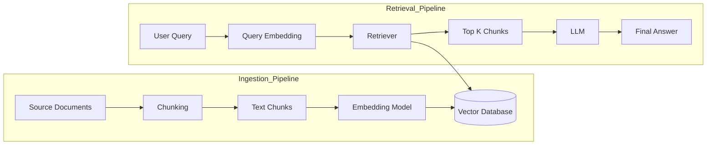

# Retrieval Augmented Generation(RAG)

## What is Retrieval Augmented Generation?

- **Retrieval-Augmented Generation** is an AI technique in which an AI system first searches for relevant information in external sources like databases,documents,and vector stores, and then uses that information to generate an answer. 
  
- This technique used in applications such as **customer support AI systems** and **Question Answering systems**.
  
## Why do an AI model need RAG?.
- **To give more accurate answers**-  It helps the AI check real information from documents or databases instead of only using what it remembers.
  
- **To provide up-to-date information**-  It allows the AI model to access new or latest data that was not part of its training.

## RAG Architecture

### What is Ingestion Pipeline?

- Knowledge building phase.
  
- Process of preparing and storing data so the system can use it later.
  
- It involves:
  1. Collecting source documents.
  2. Splitting them into smaller pieces called chunks.
  3. Converting each chunk into numerical representations known as embeddings.
  4. Storing these embeddings in a vector database for efficient retrieval.

- **Source Documents** are files that contain information such as company manuals,FAQ documents and Product descriptions.
- **Chunking** is the process of splitting of source documents data into small pieces called chunks.
- **Embedding model** is a machine learning model that converts text into numbers(numerical vectors).
- **Embeddings** are the generated number patterns.
- **Vector database** is a database that stores data in number form(vectors) so it can quickly find similar information.  **Ex: Pinecone,Chroma**

### What is Retrieval Pipeline?

- This happens when a user asks a question.
  
- Process of finding relevant information and generating an answer.
  
- It involves:
  1. Converting the user's question into embeddings (numbers).
  2. Searching the vector database for similar chunks.
  3. Sending the top matching chunks to the LLM.
  4. The LLM generates the final answer.
   
- **Cosine Similarity** is a mathematical method used to measure how similar two vectors are by calculating the cosine angle between them.

- **Cosine Similarity** Formula   =     A.B | ||A|| * ||b||
  1. A.B is the dot product of A and B.
  2. ||A|| and ||B|| are magnitudes.
- Cosine similarity values range between 0 and 1.
- If the value is close to 0, it is not a good match
- If it is 1,it is a perfect match.

## Variants of RAG 

### RAG-Sequence
- Uses same retrieved documents across entire generation.
  
### RAG-Token
- Retrieves documents at each token generation step.
  
## Summary

- RAG is a technique that combines retrieval system and language model to give better answers.
  
- It first searches for relevant documents from a database.
  
- Then it sends those documents to the LLM to generate a final answer.

- This helps the model give more accurate and up-to-date information instead of relying only on its training data.